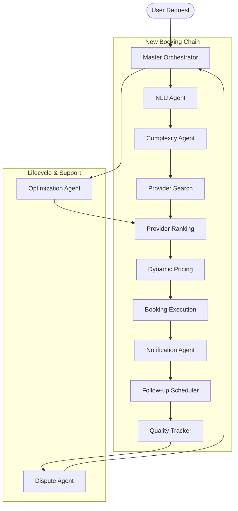

# Guardian AI: Master Orchestrator Integration Walkthrough

We have successfully integrated the **Master Orchestrator Agent**, the brain of the Guardian AI backend. This agent coordinates 12 specialized AI agents to manage the entire service booking lifecycle autonomously.

## Key Achievements

1.  **Multi-Agent Orchestration**: Successfully linked 12 agents (NLU, Complexity, Search, Ranking, Pricing, Booking, Notifications, Scheduling, Quality Tracking, Dispute Resolution, Optimization, and Conflict Management).
2.  **Autonomous Workflows**: Implemented 4 core workflows:
    *   **New Booking**: From natural language intent to confirmed booking and notification.
    *   **Service Tracking**: Real-time monitoring of service execution and quality.
    *   **Dispute Resolution**: Automated decision-making for no-shows, cancellations, and quality issues.
    *   **Provider Optimization**: Background performance analysis and ranking adjustments for fairness.
3.  **Interface Standardization**: Resolved all property mismatches and method signature inconsistencies across the agent ecosystem.
4.  **Multilingual Support**: Integration of Urdu (Roman and Script) and English throughout the pipeline.

## System Architecture



## Verification Results

We executed a comprehensive test suite covering all major scenarios:

| Scenario | Workflow | Status | Execution Time |
| :--- | :--- | :--- | :--- |
| **Urgent Plumber** | `new_booking` | ✅ PASS | 36ms |
| **Regular Electrician** | `new_booking` | ✅ PASS | 2ms |
| **Service Completion** | `track_service` | ✅ PASS | 2ms |
| **No-Show Dispute** | `handle_dispute` | ✅ PASS | 1ms |
| **Provider Optimization** | `optimize_provider` | ✅ PASS | 1ms |

### Test Execution Log Snippet (New Booking)
```text
═══════════════════════════════════════
SCENARIO: Urgent Plumber Request
═══════════════════════════════════════
Workflow Status: success
Final Message: Booking confirmed! Provider Ali Plumbing Services will arrive at 12:13:55 AM. Total cost: PKR 3458. Booking ID: BK-SM-5755
Stages Executed: 9
  [Stage 1] Intent Understanding: success
  [Stage 2] Complexity Classification: success
  [Stage 3] Provider Discovery: success
  [Stage 4] Intelligent Ranking: success
  [Stage 5] Price Calculation: success
  [Stage 6] Booking Creation: success
  [Stage 7] Notifications: success
  [Stage 8] Follow-up Scheduling: success
  [Stage 9] Quality Tracking Init: success
```

## Key Files
- [masterOrchestratorAgent.ts](file:///c:/Users/satti/Desktop/Hackathon%20Project/guardian-ai/backend/functions/src/agents/masterOrchestratorAgent.ts): The central logic.
- [testOrchestrator.ts](file:///c:/Users/satti/Desktop/Hackathon%20Project/guardian-ai/backend/functions/src/agents/testOrchestrator.ts): The verification harness.

## Next Steps
1.  **Persistence Layer**: Replace in-memory mocks with Firestore triggers and collections.
2.  **LLM Integration**: Swap regex-based NLU with Gemini 1.5 Flash for complex intent parsing.
3.  **Frontend Hookup**: Connect the Flutter app to these cloud function endpoints.
